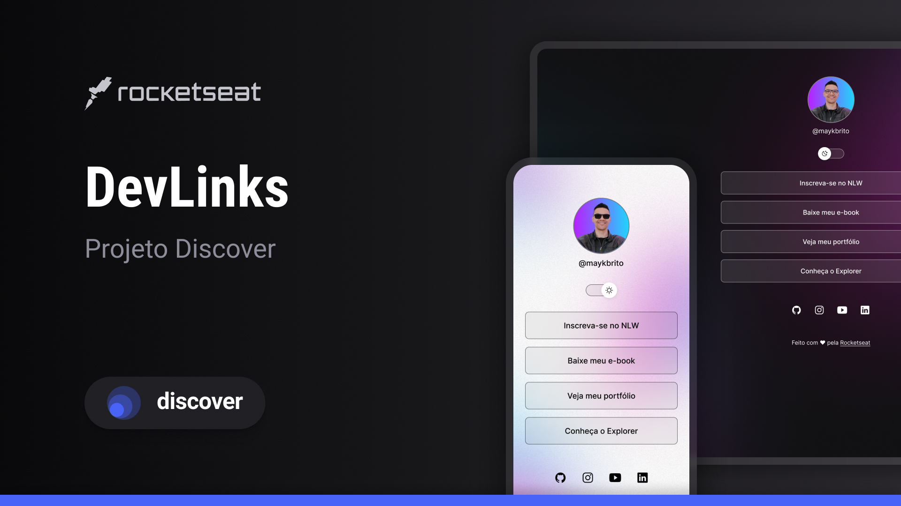

  

## 💻 Projeto 
O DevLinks é um agregador de links para utilizar como cartão de visitas online.

## 🚀 Tecnologias
Esse projeto foi desenvolvido durante o Discover da Rocketseat com as seguintes tecnologias:

- HTML
- CSS
- JavaScript
- Git e Github
- Figma

## 🔗 Layout
Você pode visualizar o layout do projeto através 
[desse link](https://www.figma.com/file/CMb5fZA2nei6aOTwUNy3ey/DevLinks-%E2%80%A2-Projeto-Discover-(Community)?type=design&node-id=10-620&t=TkTnHCofe4SHbFXF-0). 
É necessário ter uma conta no
[Figma](https://www.figma.com)

## :memo: Licença

Projeto está sob a licença de Rafael Macchi